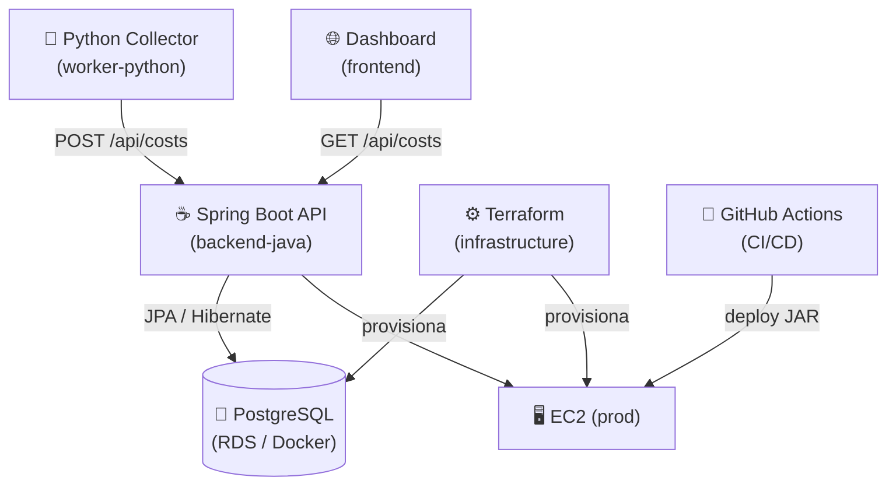

# Sentinel Cloud Optimizer

[](https://github.com/Matheus26-code/sentinel-cloud-optimizer/actions/workflows/deploy.yml)
[](https://openjdk.org/)
[](https://spring.io/projects/spring-boot)
[](https://python.org)
[](LICENSE)

Sistema de monitoramento e alertas de custos de recursos AWS, construído como projeto de portfólio com foco em boas práticas de engenharia de software.

---

## Arquitetura



**Fluxo de dados:**
1. O **Python Collector** simula coleta de métricas de custos AWS e as envia para a API REST
2. A **API Spring Boot** valida, persiste no banco e dispara alertas automáticos quando o custo excede o limite configurado
3. O **Dashboard** consome a API paginada e exibe tabela + gráfico de barras em tempo real
4. O **Terraform** provisiona EC2 + RDS na AWS; o **GitHub Actions** faz deploy automático a cada push na `main`

---

## Stack Técnica

| Camada | Tecnologia | Por quê |
|--------|-----------|---------|
| Backend | Java 21 + Spring Boot 3.2 | Ecossistema maduro, tipagem forte, facilidade de testar |
| ORM | Spring Data JPA + Hibernate | Abstração do banco sem perder controle quando necessário |
| Banco | PostgreSQL 16 | ACID, JSON nativo, excelente suporte no ecossistema Java |
| Coletor | Python 3 + Requests | Scripts de coleta/integração são naturalmente Python |
| Frontend | HTML + Tailwind CSS + Chart.js | Zero dependências de build para um dashboard simples |
| IaC | Terraform | Estado declarativo, plano de execução antes de aplicar |
| CI/CD | GitHub Actions | Integração nativa com o repositório, free tier generoso |
| Containers | Docker + Docker Compose | Ambiente local reproduzível sem instalar dependências |

---

## Funcionalidades

- **API REST** com endpoints de criação, listagem paginada e remoção de custos
- **Alertas automáticos** quando o custo ultrapassa o limite configurável (`budget.alert.limit`)
- **Validação de entrada** com Bean Validation (`@NotBlank`, `@Positive`)
- **Swagger UI** disponível em `/swagger-ui.html`
- **Coletor Python** com retry exponencial, logging estruturado e `--dry-run`
- **Infraestrutura como código** com variáveis sensíveis externalizadas
- **Suite de testes** cobrindo unitários, camada web e integração (22 testes, H2 in-memory)
- **Pipeline CI/CD** que bloqueia deploy se algum teste falhar

---

## Rodando Localmente

### Pré-requisitos
- Docker e Docker Compose
- Java 21+ (só se quiser rodar sem Docker)
- Python 3.10+ (para o collector)

### Com Docker Compose (recomendado)

```bash
# 1. Clone o repositório
git clone https://github.com/Matheus26-code/sentinel-cloud-optimizer.git
cd sentinel-cloud-optimizer

# 2. Configure o ambiente
cp .env.example .env
# Edite .env e defina POSTGRES_PASSWORD

# 3. Suba banco + backend
docker-compose up --build

# API:     http://localhost:8080/api/costs
# Swagger: http://localhost:8080/swagger-ui.html
```

### Só o banco (backend na IDE)

```bash
# Sobe apenas o PostgreSQL
docker-compose up db

# Configure o perfil dev (não é commitado — veja .env.example)
cp .env.example backend-java/cloud-optimizer/src/main/resources/application-dev.properties
# Edite o arquivo com suas credenciais locais

# Rode a aplicação com o perfil dev
cd backend-java/cloud-optimizer
./mvnw spring-boot:run -Dspring-boot.run.profiles=dev
```

### Coletor Python

```bash
cd worker-python
pip install -r requirements-dev.txt

# Enviar dados para a API local
python collector.py

# Simular sem enviar (útil para testar)
python collector.py --dry-run

# Ver todas as opções
python collector.py --help

# Rodar os testes
pytest test_collector.py -v
```

### Testes do Backend

```bash
cd backend-java/cloud-optimizer
./mvnw verify -Dspring.profiles.active=test
# 22 testes: 7 unitários + 8 controller + 6 integração + 1 contexto
```

---

## Estrutura do Projeto

```
sentinel-cloud-optimizer/
├── backend-java/cloud-optimizer/   # API REST Spring Boot
│   ├── src/main/java/.../
│   │   ├── config/         # WebConfig (CORS)
│   │   ├── controller/     # AwsCostController
│   │   ├── dto/            # Request/Response DTOs + Mapper
│   │   ├── model/          # Entidades JPA
│   │   ├── repository/     # Spring Data repositories
│   │   └── service/        # AwsCostService + BudgetAlertService
│   ├── src/test/           # Testes unitários, web e integração
│   └── Dockerfile          # Multi-stage build (JDK → JRE Alpine)
│
├── worker-python/          # Coletor de custos
│   ├── collector.py        # Retry, logging, argparse
│   └── test_collector.py   # Testes pytest
│
├── infrastructure/         # Terraform (AWS)
│   ├── main.tf             # EC2 + RDS + Security Groups
│   ├── variables.tf        # Variáveis sensíveis (sem valores hardcoded)
│   └── outputs.tf          # IP da EC2 e endpoint do RDS
│
├── frontend/               # Dashboard HTML
│   └── index.html          # Tailwind + Chart.js
│
├── .github/workflows/
│   └── deploy.yml          # CI: testes → build → deploy EC2
│
├── docker-compose.yml      # Ambiente local completo
└── .env.example            # Template de variáveis de ambiente
```

---

## Decisões Técnicas

**Por que DTOs em vez de expor entidades JPA diretamente?**
Expor `@Entity` pela API cria acoplamento entre o esquema do banco e o contrato da API. Se a tabela mudar, a API quebra para os clientes. DTOs também previnem *mass assignment* — sem eles, um cliente mal-intencionado poderia tentar enviar campos como `id` ou `captureDate`.

**Por que constructor injection em vez de `@Autowired` em campo?**
Campos injetados por `@Autowired` não podem ser `final`, o que permite reatribuição acidental. Com constructor injection (via `@RequiredArgsConstructor` do Lombok), os campos são imutáveis e o Spring falha no startup se uma dependência estiver faltando — em vez de falhar silenciosamente em runtime.

**Por que separar `BudgetAlertService` do `AwsCostService`?**
Single Responsibility Principle. Se a lógica de alertas evoluir (enviar email, Slack, etc.), apenas `BudgetAlertService` precisa mudar. Também corrigiu um bug de ordem: o alerta precisa ser criado *depois* que o custo é persistido, pois o `@OneToOne` precisa de uma FK válida.

**Por que H2 nos testes de integração e não um PostgreSQL de teste?**
Para testes rodarem sem infraestrutura externa (CI sem serviços externos, onboarding mais rápido). O modo `MODE=PostgreSQL` do H2 cobre os casos de uso do projeto. Em um sistema de produção maior, usaria Testcontainers com PostgreSQL real.

**Por que `mock-maker-subclass` em vez do inline mock maker do Mockito?**
O mock maker inline usa dynamic agent loading, que é restrito a partir do Java 21. O subclass maker usa herança/CGLIB, não precisa de flags JVM especiais e funciona com Java 21/25 sem configuração adicional.

---

## Melhorias Futuras

- [ ] Integrar com a **AWS Cost Explorer API** (substituir dados simulados)
- [ ] Adicionar **autenticação JWT** na API
- [ ] Implementar **Testcontainers** para testes de integração com PostgreSQL real
- [ ] Configurar **backend remoto Terraform** com S3 + DynamoDB (lock de estado)
- [ ] Publicar imagem Docker no **GitHub Container Registry** via Actions
- [ ] Adicionar **métricas com Micrometer + Prometheus** no backend
- [ ] Criar um **agendamento automático** do collector (cron ou AWS EventBridge)

---

## O Que Aprendi

Este projeto foi construído durante minha transição de carreira para desenvolvimento back-end. Os principais aprendizados práticos foram:

- Como **credenciais em repositórios públicos** são detectadas por bots em minutos — e como reescrever histórico com `git filter-repo`
- A diferença real entre **expor entidades JPA vs DTOs** — não é só teoria, é sobre não quebrar a API quando o banco muda
- Por que **constructor injection** existe: testei na prática que `@InjectMocks` funciona melhor e o Spring detecta dependências faltantes no startup
- Como **profiles do Spring Boot** resolvem o problema de "funciona na minha máquina" — dev aponta para docker-compose, prod lê variáveis de ambiente
- Que **testes sem infraestrutura** (H2, Mockito) rodam em segundos, enquanto testes com banco real levam segundos a minutos — e isso importa em CI
- A complexidade real de **compatibilidade de versões**: Lombok + Java 21, Mockito inline mocking + Java 25, e como diagnosticar a causa raiz em vez de "tentar até funcionar"

---

*Projeto desenvolvido por [Matheus Braz](https://github.com/Matheus26-code)*
